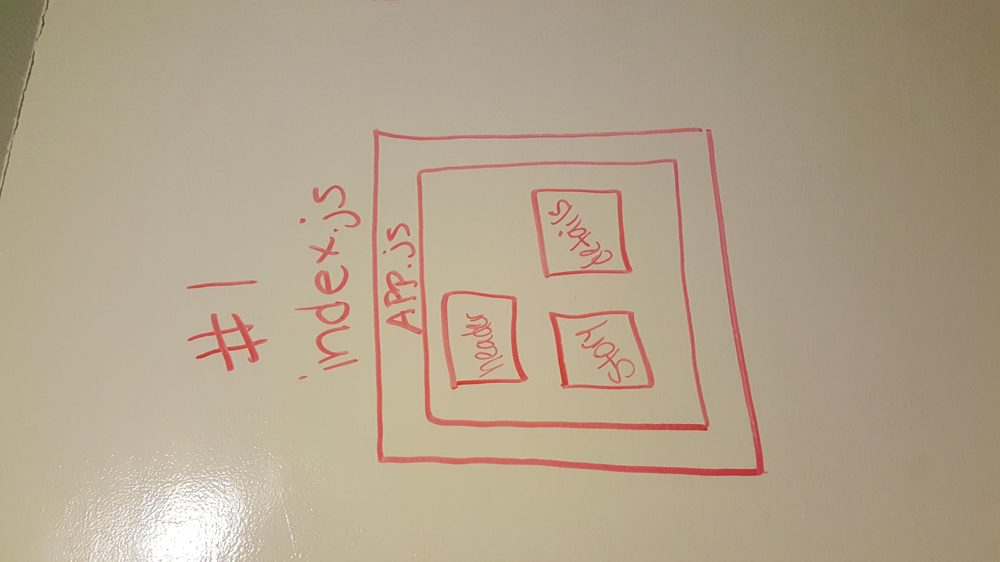
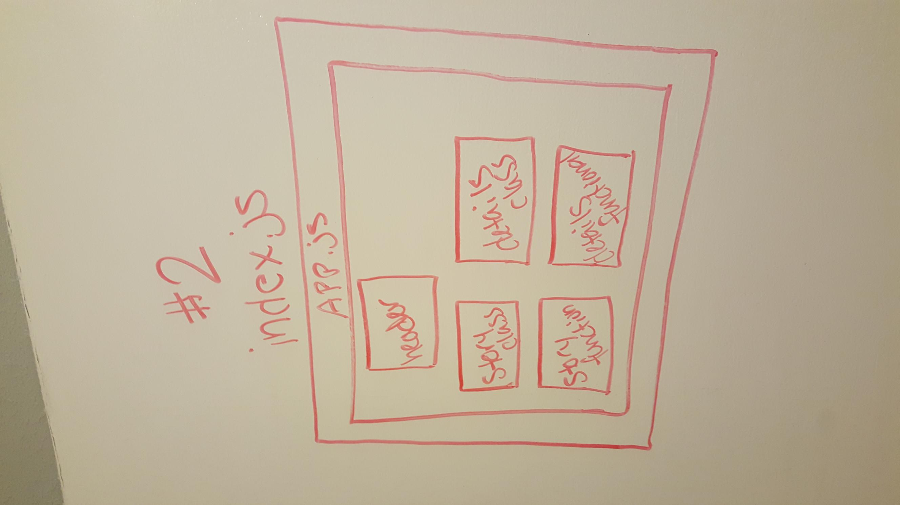
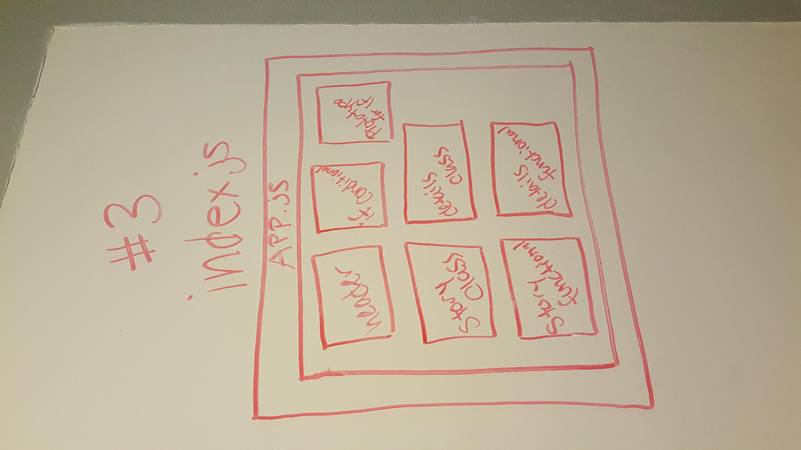
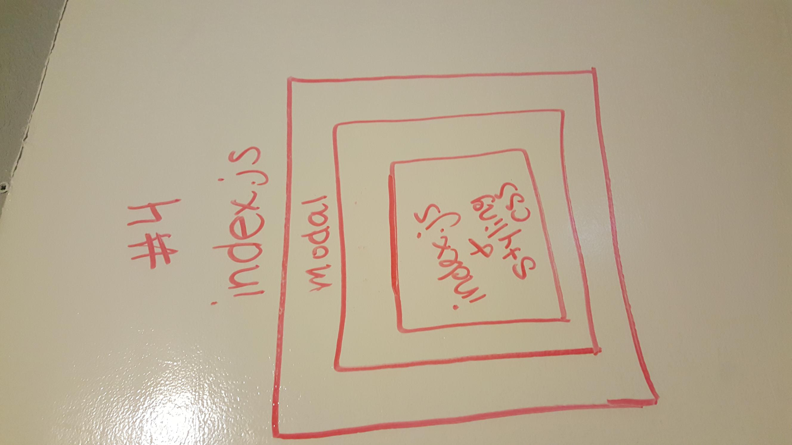

 LAB
=================================================

## Routing and Composition

### Author: Siobhan Niess

## Assignment 1 - Warmups

### Links and Resources
* [repo](https://codesandbox.io/s/52vm6v7w1k)
* [site](https://52vm6v7w1k.codesandbox.io/)

### Modules
##### Exported Values and Methods
- `index.js` renders the app
- `app.js` holds the renderd elements and story/details components
- `components/header/header.js` this is where the headers is held

#### UML

## Assignment 2 - Modularize and Functionalize

### Links and Resources
* [repo](https://codesandbox.io/s/py0kkjn4yx)
* [site](https://py0kkjn4yx.codesandbox.io/)

### Modules
##### Exported Values and Methods
* `index.js` renders the app
* `app.js` the order for the components
* `components/header/header.js` holds the header
* `/details-class.js` hold the class details component
* `/details-arrow.js` holds functionals for the details component
* `/story-class.js` hold the class story component
* `/story-arrow.js` holds functionals for the story component

#### UML

## Assignment 3 - Conditionals

### Links and Resources
* [repo](https://codesandbox.io/s/py0kkjn4yx)
* [site](https://py0kkjn4yx.codesandbox.io/)

### Modules
##### Exported Values and Methods
* `index.js` renders the app
* `app.js` the order for the components
* `components/header/header.js` holds the header
* `/details-class.js` hold the class details component
* `/details-arrow.js` holds functionals for the details component
* `/story-class.js` hold the class story component
* `/story-arrow.js` holds functionals for the story component
* `components/if/if.js` holds the logic for the components
* `components/if/prototype.js` holds the children and conditions logic for the If

#### UML

## Assignment 4 - Modal

### Links and Resources
* [repo](https://codesandbox.io/s/j3wq1vvjp9)
* [site](https://j3wq1vvjp9.codesandbox.io/#)

### Modules
#### Exported Values and Methods
* `/app.js` holds the class to show the form and the characters
* `/index.js` renders the app
* `components/modal/form.js` holds the logic for the form
* `components/modal/index.js` holds the layout for the modal
* `components/modal/modal.js` holds the modal logic

#### UML
